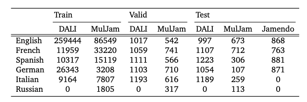

# Preconstructed Data Splits

This directory contains preconstructed data splits for the datasets used for segmentation.

MulJam files follow the official splits here: [https://github.com/zhuole1025/LyricWhiz/tree/main/MulJam_v2.0/preconstructed-split](https://github.com/zhuole1025/LyricWhiz/tree/main/MulJam_v2.0/preconstructed-split)

MultiLang Jamendo file is generated from the official annotation: [https://github.com/f90/jamendolyrics](https://github.com/f90/jamendolyrics)

Note that these splits are for the latest version datasets: DALI v2.0, MulJam v2.0, and MultiLang Jamendo v1.1. 
They might **NOT** be exactly the same as the splits used in a few previous papers, which uses older versions of the datasets.
To avoid confusion, splits for older versions will be provided upon request. Please open an issue if you need them to reproduce results.